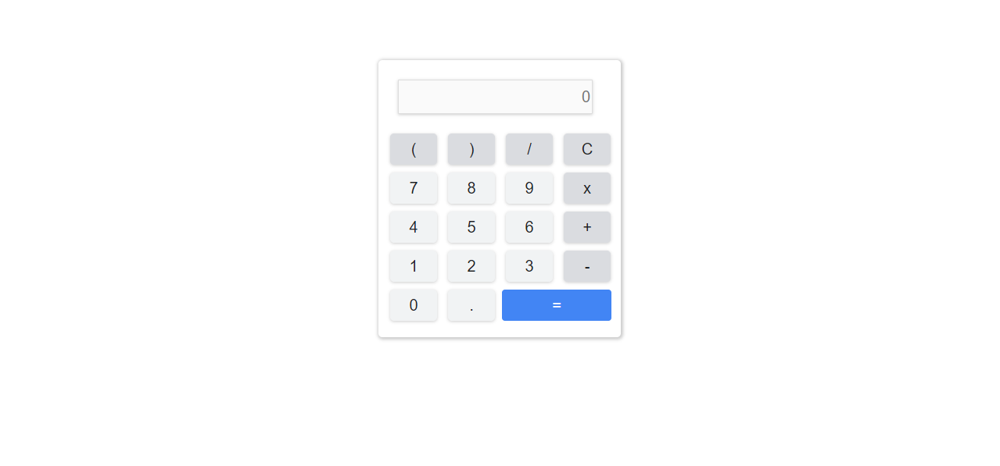

# Calculadora
A calculadora contém quatro operações, sendo elas, divisão, multiplicação, soma e subtração além de ter opção de incluir parênteses, ponto para números quebrados e opção de limpar o visor. O funcionamento e bem simples, as expressões inseridas pelo usuário são tratadas como strings e o cálculo é feito utilizando a função eval do JavaScript.

## Feito Com:

Copyright © DavidWillian

